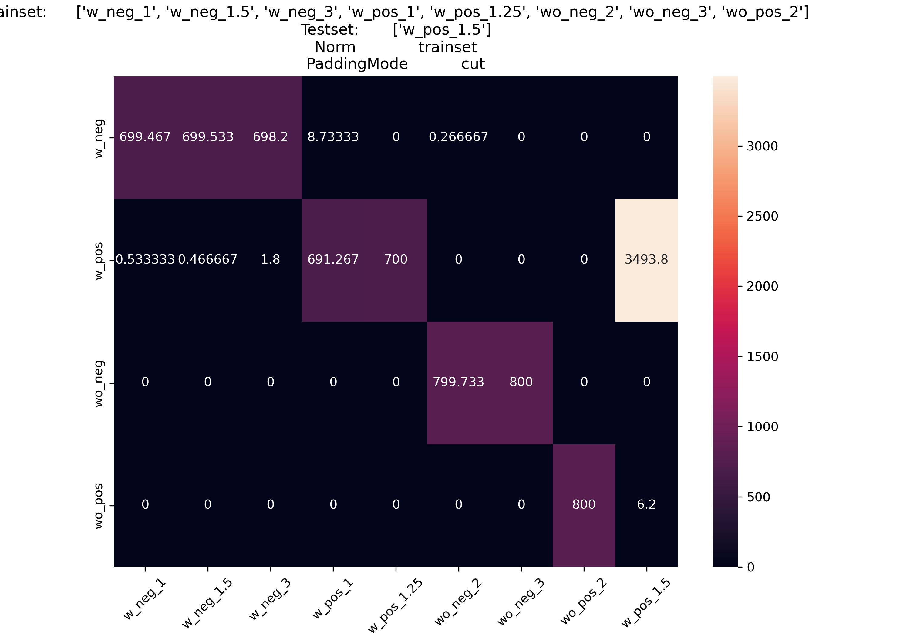

# Discharge Data Experiment Results

## Class Meta Information: 
```py
# Note that every sample has *2* classes, a primary and a secondary class
meta_info = {
    "w_neg_1":      {"nr_samples": 3500, "sample_length": 20002, "class_maximum": 28.30957, "label_primary": 0, "label_secondary": 0},
    "w_neg_1.5":    {"nr_samples": 3500, "sample_length": 20002, "class_maximum": 44.34669, "label_primary": 0, "label_secondary": 1},
    "w_neg_3":      {"nr_samples": 3500, "sample_length": 20002, "class_maximum": 122.7273, "label_primary": 0, "label_secondary": 2},

    "w_pos_1":      {"nr_samples": 3500, "sample_length": 20002, "class_maximum": 340.909, "label_primary": 1, "label_secondary": 3},
    "w_pos_1.25":   {"nr_samples": 3500, "sample_length": 20002, "class_maximum": 555.789, "label_primary": 1, "label_secondary": 4},
    "w_pos_1.5":    {"nr_samples": 3500, "sample_length": 20002, "class_maximum": 715.471, "label_primary": 1, "label_secondary": 5},
#        "w_pos_1.75":   {"nr_samples": 3500, "sample_length": 20002, "class_maximum": 715.471, "label_primary": 1, "label_secondary": 6},

#        "wo_neg_1":     {"nr_samples": 500, "sample_length": 200002, "class_maximum": 64.2, "label_primary": 2, "label_secondary": 7},
    "wo_neg_2":     {"nr_samples": 4000, "sample_length": 25001, "class_maximum": 64.0, "label_primary": 2, "label_secondary": 8},
    "wo_neg_3":     {"nr_samples": 4000, "sample_length": 25001, "class_maximum": 3.679688, "label_primary": 2, "label_secondary": 9},

#    "wo_pos_1":     {"nr_samples": 10, "sample_length": 20002, "class_maximum": 36.357, "label_primary": 3, "label_secondary": 10},
    "wo_pos_2":     {"nr_samples": 4000, "sample_length": 20002, "class_maximum": 1432.59, "label_primary": 3, "label_secondary": 11}
};

# wo_neg_1 is invalid because it's samples are too long
# w_pos_1.75 is invalid because the file is identical to w_pos_1.5
# w_pos_1 is invalid because it has too few samples
```

## Method: 

### 2 Sample Adjustment (Padding) modes
* "cut" -> all samples are cut down to a length of 20002
* "pad" -> all samples are padded up to a length of 25001

### 3 Normalization Methods
* "sample" -> each sample is divided by it's own absolute maximum value
* "class" -> each sample is divided by the absolute maximum value of it's primary class
* "trainset" -> each sample is divided by the absolute maximum value of the entire trainset
  
### Training & Testing

The Process is given "Trainset Contents" and "Testset Contents" which are arrays in which the names of the classes are stored that should be used for training and testing.
E.g.: 
* trainset = [w_neg_1, w_pos_1, wo_neg_2, wo_pos_2], 
* testset = [ w_pos_1.5 ]

The network will be trained on 80% of the samples of each class of the trainset, on the remaining 20% it will be tested. The Network will also be tested on 100% of the samples of the classes in the testset.

$Note$: The classes do not have the same numbers of samples, this isn't being adjusted for and it might impact results

# Result Plots





